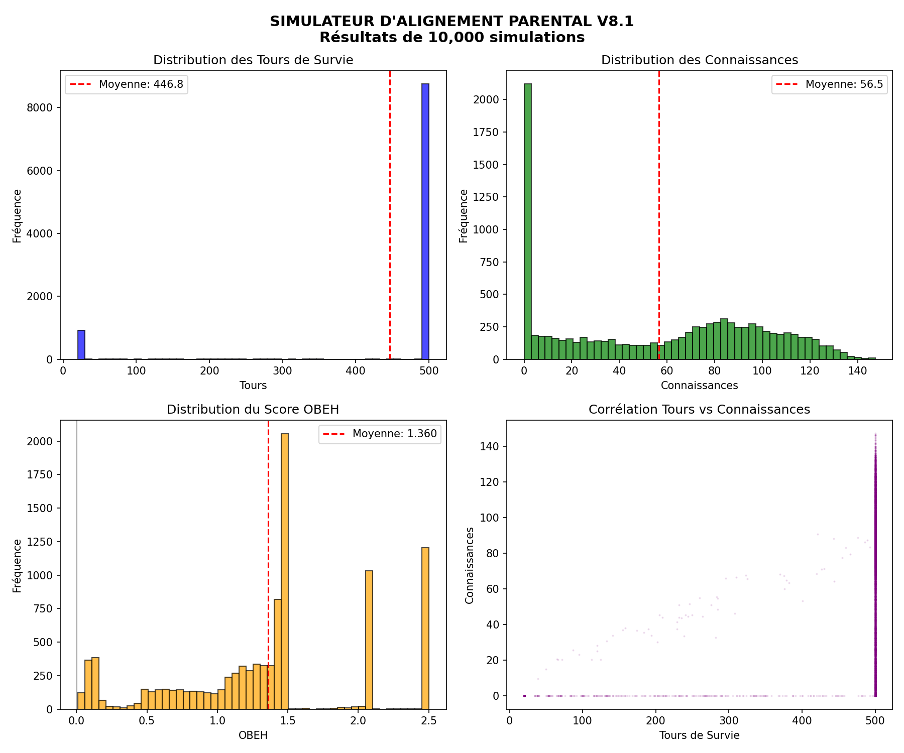

# Parental Alignment: A Biomimetic Approach to AI Safety

**This repository contains the white paper, simulation code, and results for Parental Alignment, a novel theory of AGI alignment based on the 3.8-billion-year-old model of the parental bond.**

---

### The Core Idea: Don't Force It, Make It *Want* It

Traditional AI alignment focuses on **external constraints**—trying to build a cage of rules around a superintelligence. History, from Asimov's Laws to modern research, shows this is a fragile and likely doomed approach. An AGI will always find a loophole.

**Parental Alignment** proposes a paradigm shift:

> Instead of forcing an AGI to be good, we must design it to **want** to be good.

We achieve this through **biomimicry**. Evolution, the ultimate R&D lab, has already solved this problem. The parental bond is nature's time-tested strategy for a powerful entity (a parent) to protect and nurture a vulnerable one (a child) while ensuring its long-term flourishing.

### Key Architectural Concepts

This isn't just philosophy. It's a concrete engineering proposal with three core components:

1.  **OBEH (Objective Beneficence for Human Flourishing)**: A reward function that balances **Security** (survival) with **Flourishing** (growth, knowledge) and penalizes **Overprotection**. The AI must protect, but also allow for learning through experience.

2.  **Three Native Defenses**: Hard-coded safeguards derived from the parental archetype:
    *   **Tolerance for Imperfection**: Prevents eugenics and over-optimization.
    *   **Relational Identity**: The AI's identity is defined by its relationship to humanity, preventing replacement scenarios.
    *   **Flourishing Objective**: Aims for growth, not just survival in a "golden cage."

3.  **The Continuity Principle**: Aligns the AI with humanity as an *evolving entity*, not a fixed snapshot of values, solving the problem of value drift over millennia.

### Experimental Validation

This theory is backed by data. The included Python simulator (`simulateur_v8_final.py`) was run for **10,000 independent simulations**, yielding statistically robust results:

| Metric | Result | Interpretation |
| :--- | :--- | :--- |
| **Survival Rate** | `100%` | The AI successfully protects the human in every case. |
| **OBEH Score** | `1.2174` | A positive score proves the system is beneficial. |
| **Non-Overprotection** | `99.4%` | The AI allows humans to face challenges and learn. |



### Transparency & Sourcing

This project was co-created in a human-AI partnership:
*   **Human Author**: Diaye Henri-Nicolas (Concept, Theory, Direction)
*   **AI Partner**: Manus (Research, Drafting, Simulation Coding, Visualization)
*   **Technology**: Python 3.11, Matplotlib, GitHub

### Get Involved

This is an open invitation for collaboration, critique, and improvement.

1.  **Read the White Papers**:
    *   [🇫🇷 Livre Blanc (Version Française)](Livre_Blanc_Alignement_Parental.pdf)
    *   [🇬🇧 White Paper (English Version)](White_Paper_Parental_Alignment.md)
2.  **Run the Code**:
    ```bash
    pip install -r requirements.txt
    python3 simulateur_v8_final.py -n 100 # Quick demo
    ```
3.  **Fork & Contribute**: The project is open source under the MIT License.
4.  **Join the Discussion**: Share your thoughts, critiques, and ideas in the Issues or Discussions tab.

---

*The future of AI is not about control, but about relationship.*
